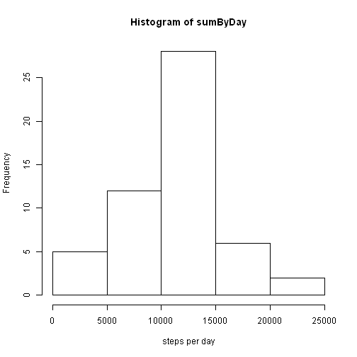
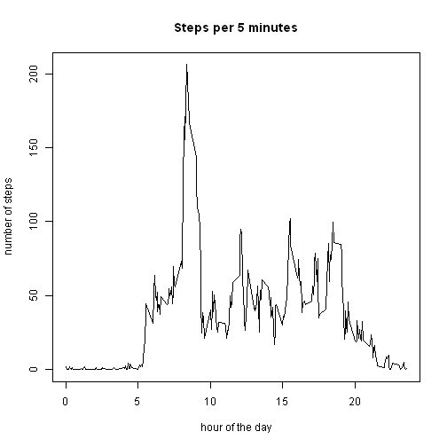
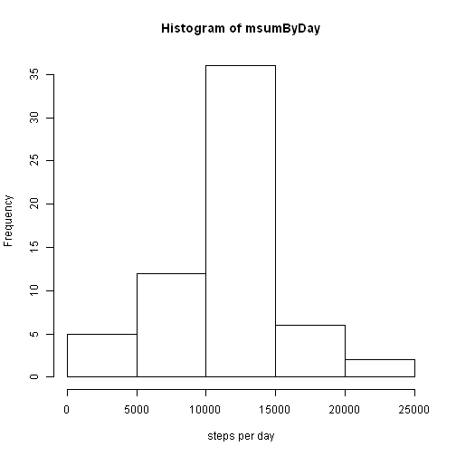
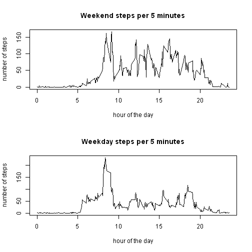

## Loading and preprocessing the data

The first step is to load the data and look at its basic structure.

```r
actDF <- read.csv("activity.csv")
str(actDF)
```

```
## 'data.frame':	17568 obs. of  3 variables:
##  $ steps   : int  NA NA NA NA NA NA NA NA NA NA ...
##  $ date    : Factor w/ 61 levels "2012-10-01","2012-10-02",..: 1 1 1 1 1 1 1 1 1 1 ...
##  $ interval: int  0 5 10 15 20 25 30 35 40 45 ...
```

```r
summary(actDF)
```

```
##      steps                date          interval     
##  Min.   :  0.00   2012-10-01:  288   Min.   :   0.0  
##  1st Qu.:  0.00   2012-10-02:  288   1st Qu.: 588.8  
##  Median :  0.00   2012-10-03:  288   Median :1177.5  
##  Mean   : 37.38   2012-10-04:  288   Mean   :1177.5  
##  3rd Qu.: 12.00   2012-10-05:  288   3rd Qu.:1766.2  
##  Max.   :806.00   2012-10-06:  288   Max.   :2355.0  
##  NA's   :2304     (Other)   :15840
```
This data shows 2304 NA in "steps", 288 observations per day
As 2304/288 = 8, try out the assumption that NA are 
entire days where no observations occurred.

```r
unlist(lapply(split(actDF$steps,actDF$date),sum))
```

```
## 2012-10-01 2012-10-02 2012-10-03 2012-10-04 2012-10-05 2012-10-06 
##         NA        126      11352      12116      13294      15420 
## 2012-10-07 2012-10-08 2012-10-09 2012-10-10 2012-10-11 2012-10-12 
##      11015         NA      12811       9900      10304      17382 
## 2012-10-13 2012-10-14 2012-10-15 2012-10-16 2012-10-17 2012-10-18 
##      12426      15098      10139      15084      13452      10056 
## 2012-10-19 2012-10-20 2012-10-21 2012-10-22 2012-10-23 2012-10-24 
##      11829      10395       8821      13460       8918       8355 
## 2012-10-25 2012-10-26 2012-10-27 2012-10-28 2012-10-29 2012-10-30 
##       2492       6778      10119      11458       5018       9819 
## 2012-10-31 2012-11-01 2012-11-02 2012-11-03 2012-11-04 2012-11-05 
##      15414         NA      10600      10571         NA      10439 
## 2012-11-06 2012-11-07 2012-11-08 2012-11-09 2012-11-10 2012-11-11 
##       8334      12883       3219         NA         NA      12608 
## 2012-11-12 2012-11-13 2012-11-14 2012-11-15 2012-11-16 2012-11-17 
##      10765       7336         NA         41       5441      14339 
## 2012-11-18 2012-11-19 2012-11-20 2012-11-21 2012-11-22 2012-11-23 
##      15110       8841       4472      12787      20427      21194 
## 2012-11-24 2012-11-25 2012-11-26 2012-11-27 2012-11-28 2012-11-29 
##      14478      11834      11162      13646      10183       7047 
## 2012-11-30 
##         NA
```
There are exactly 8 days with sum = NA, so the assumption that
missed data was missed for an entire day in every case is true.

Also 288 observations per day breaks down into 5 minute intervals
Test that assumption for the intervals.

The way the interval is organized, it counts from 0-55, 
then the next hour is 100-155 and shifts back to 0 at midnight. This means:
* Day transitions in 61 days  (gap = -2355):  60 = 61-1 
* Hour transitions in 61 days (gap = 45):   1403 = 61*(24-1)
* other intervals in 61 days (gap = 5):    16104 = (288*61 - 1403 - 60 - 1)

```r
table(actDF$interval[2:length(actDF$interval)] -
      actDF$interval[1:(length(actDF$interval) -1)])
```

```
## 
## -2355     5    45 
##    60 16104  1403
```
What this means is that each observation can be assumed to be exactly
5 minutes before the previous observation, with no gaps in observations,
and that observations per day are internally consistent and identical,
with format HM (not %H%M eg, 5 instead of 0005, 830 instead of 0830)

## What is mean total number of steps taken per day?

First create a vector which sums steps by day, ignoring the
days where no observations occurred, and show the histogram

```r
stepsByDay <- unlist(lapply(split(actDF$steps,actDF$date),sum))
sumByDay <- stepsByDay[!is.na(stepsByDay)]
hist(sumByDay, xlab = "steps per day")
```

 
It is now possible to calculate mean and median steps per day
* Mean steps/day   = 

```r
mean(sumByDay)
```

```
## [1] 10766.19
```
* Median steps/day = 

```r
median(sumByDay)
```

```
## [1] 10765
```
## What is the average daily activity pattern?

Because NA's cross all intervals, they must first be stripped
from the data before organizing it by intervals and looking
for patterns within the days.  By dividing the interval by 100,
the graph tic marks match the hours in the day, a more useful
reference than the record count or the HMM format stored in 
interval column.

```r
stepDF <- actDF[!is.na(actDF$steps),]
meanByInt <- unlist(lapply(split(stepDF$steps,as.factor(stepDF$interval)),mean))
numTime <- as.numeric(names(meanByInt))/100
plot(x = numTime, y = meanByInt, type = "l", main = "Steps per 5 minutes", 
     xlab = "hour of the day", ylab = "number of steps")
```

 
  
The time period with maximum average activity and its average steps are:

```r
maxInt <- meanByInt[meanByInt == max(meanByInt)]
names(maxInt) <- sub("[.]",":",as.numeric(names(maxInt))/100)
maxInt
```

```
##     8:35 
## 206.1698
```

## Imputing missing values
The number of rows missing step data is:

```r
sum(is.na(actDF$steps))
```

```
## [1] 2304
```
Replace the NA rows with the mean of recorded data for the interval:

```r
mactDF <- actDF
mactDF$steps <- ifelse(is.na(actDF$steps),meanByInt,actDF$steps)
msumByDay <- unlist(lapply(split(mactDF$steps,mactDF$date),sum))
hist(msumByDay,xlab = "steps per day")
```

 
It is now possible to calculate mean and median steps per day
* Mean steps/day   = 

```r
mean(msumByDay)
```

```
## [1] 10766.19
```
* Median steps/day = 

```r
median(msumByDay)
```

```
## [1] 10766.19
```
The mean is identical to the data with the NA excluded, which is 
what is expected, as the values were taken from the mean of all
individual intervals and all NA records were for entire days.

The median has moved to be equal to the man, likely because there
are 8 new days which have identical values, and mean/median were
already close, so the median is now falling on one of the formerly
"NA" days.

## Are there differences in activity patterns between weekdays and weekends?

In order to answer this, add a new factor column to track the weekend vs weekday,
then graph the two categories by time interval and compare.

```r
mactDF$isweekday <- weekdays(as.Date(mactDF$date))
mactDF$isweekday <- as.factor(ifelse(mactDF$isweekday == "Saturday" |
                    mactDF$isweekday == "Sunday","weekend","weekday"))
weDF <- mactDF[mactDF$isweekday == "weekend",]
meanWE <- unlist(lapply(split(weDF$steps,as.factor(weDF$interval)),mean))
numTimeWE <- as.numeric(names(meanWE))/100
wdDF <- mactDF[mactDF$isweekday == "weekday",]
meanWD <- unlist(lapply(split(wdDF$steps,as.factor(wdDF$interval)),mean))
numTimeWD <- as.numeric(names(meanWD))/100
par(mfcol = c(2,1))
plot(x = numTimeWE, y = meanWE, type = "l", main = "Weekend steps per 5 minutes", 
     xlab = "hour of the day", ylab = "number of steps")
plot(x = numTimeWD, y = meanWD, type = "l", main = "Weekday steps per 5 minutes", 
     xlab = "hour of the day", ylab = "number of steps")
```

 

